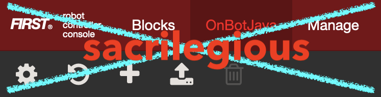
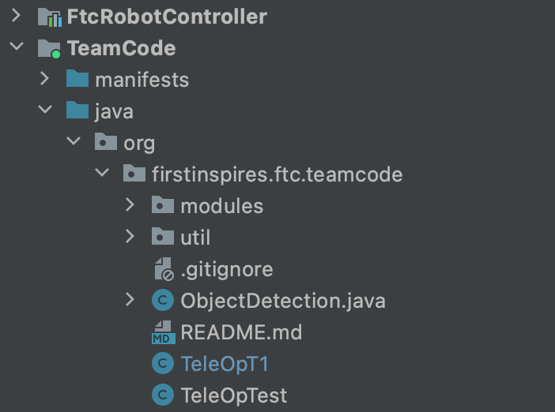

# FTC Code Standard Reference
*This repositiory servers as a reference guide for standards that certain classes should/can follow*

## Overview

When it comes to managing code for FTC, it is useful to consider abstracting and generalizing segments of reusable code. This process allows for more organized code and less redundant coding of existing parts. This repository provides a mature model in which code can be structured in. It (this repositiory) also provides certain classes that can be used side-by-side with any current version of robot controller - notably `/util/TelemetryWrapper.java` and `/util/ButtonHelper.java`. 

## Recommended Development Environment

### ~~OnBotJava~~



Avoid the devil: **<u>DO NOT</u>** use OnBotJava unless you want to experience:

- Randomly disappearing classes
- Classes being replace by blank unicode characters
- Classes appearing but not appearing
- More ~~functionality~~ yet to be explored…

### Android Studio

Android studio can either be used with ADB or direct USB installation of the FTC app. (USB installation can sometimes fail to update the codebase - in previous versions)

It is also much easier to update code to some code base with Android Studio. We can use, for example, GitHub for maintaining the codebase. 

To setup code within the RobotController app, simply clone your code repository to replace the `java/org/firstinspires/ftc/teamcode` folder.

#### Example using Git:

```bash
git clone https://github.com/FIRST-Tech-Challenge/FtcRobotController.git
cd FtcRobotController/
sudo rm -r .git
cd TeamCode/src/main/java/org/firstinspires/ftc/teamcode/
rm *
git clone https://github.com/your/repository.git teamcode
```

The Android Studio project should looks something like this:



Now, simply pull, edit, and push!

## File Structure

The entire codebase is structure with three parts:

- Root directory: Home for all main classes - Autonomous and TeleOp - the high level classes
- Utilities: Utilities for Autonomous/TeleOp. These are generally unchanged as they are directly implementable. (For example usage, reference barebone TeleOp/Autonomous classes in `/`)
- Modules: Contains all discrete components on the robot

The purpose of each part is self-explanatory. TeleOp/Autonoumous classes should import all classes in both `modules` and `util`, while Module classes should import only `util`.

## Class Specifics

### `/` (TeleOp and Autonomous - Top Level Classes)

| File              | Comment                                         |
| ----------------- | ----------------------------------------------- |
| ./TeleOpTest.java | A barebone TeleOp class for TeleOp Mode         |
| ./AutoOpTest.java | A barebone Autonomous class for Autonomous Mode |

### `/util/` (Utility Classes)

| File                    | Comment                                                      |
| ----------------------- | ------------------------------------------------------------ |
| ./TelemetryWrapper.java | A wrapper for the telemetry class - for simplified telmetry updating |
| ./ButtonHelper.java     | A button helper for specifying and unifying gamepad button listening |

### `/modules/` (Modules for Robotic Components)

| File                  | Comment                      |
| --------------------- | ---------------------------- |
| ./Modulable.java      | Interface for module classes |
| ./ModuleTemplate.java | Template for modules         |
| ./DriveTrain.java     | A sample driveTrain class    |

